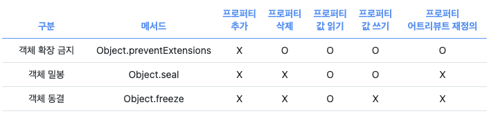

# property(프로퍼티)와 attribute(어트리뷰트)

> 자바스크립트 엔진의 내부 로직에는 원칙적으로는 접근할 수 없지만, 내부 슬룻(__proto__)를 통해 간접적으로 접근할 수 있습니다.

### property 접근

```javascript
const test = {};

// 접근 방법
test.__proto__ // Object.prototype
```

### 데이터 프로퍼티

* `value`
    * 속성에 연관된 값입니다. 유효한 JavaScript 값(숫자, 객체, 함수 등)은 모두 사용할 수 있습니다. 기본 값은 undefined입니다.

* `writable`
    * 할당 연산자 (en-US)로 속성의 값을 바꿀 수 있으면 true입니다. 기본 값은 false입니다.

접근자 서술자는 다음 키를 선택사항으로 가집니다.

* `get`
    * 속성의 접근자로 사용할 함수입니다. 접근자가 없으면 undefined입니다. 이 속성에 접근하면, 접근할 때 사용한 객체(속성의 주인 객체와 다를 수 있음)를 이 함수의 this로 설정하고, 매개변수 없이
      호출한 뒤 그 반환 값을 이 속성의 값으로 취급합니다. 기본 값은 undefined입니다.

* `set`
    * 속성의 설정자로 사용할 함수입니다. 설정자가 없으면 undefined입니다. 이 속성에 값을 할당하면, 할당할 때 사용한 객체를 이 함수의 this로 설정하고, 한 개의 매개변수(할당 중인 값)로
      호출합니다. 기본 값은 undefined입니다.

> value, writable, get, set 키를 모두 지니고 있지 않은 서술자는 데이터 서술자로 간주합니다. 반면 value 또는 writable을 get 또는 set 키와 함께 가지고 있으면 오류가 발생합니다.

* `configurable`
    * 속성의 값을 변경할 수 있고, 객체에서 삭제할 수도 있으면 true입니다. 기본 값은 false입니다.

* `enumerable`
    * 속성이 객체의 속성 열거 시 노출되면 true입니다. 기본 값은 false입니다.

데이터 서술자는 다음의 키를 선택적으로 포함할 수 있습니다.

```javascript
// __proto__ 사용
var obj = {};
var descriptor = Object.create(null); // 상속받은 속성 없음
descriptor.value = 'static';

// 기본 값은 열거 불가, 설정 불가, 쓰기 불가
Object.defineProperty(obj, 'key', descriptor);

// 기본 값 명시하기
Object.defineProperty(obj, 'key', {
  enumerable: false,
  configurable: false,
  writable: false,
  value: 'static'
});

// 같은 객체를 재활용하기
function withValue(value) {
  var d = withValue.d || (
    withValue.d = {
      enumerable: false,
      writable: false,
      configurable: false,
      value: null
    }
  );

  // 중복 할당 방지
  if (d.value !== value) d.value = value;

  return d;
}

Object.defineProperty(obj, 'key', withValue('static'));

// 객체 동결을 사용할 수 있다면 프로토타입의 변형을 방지하기
// (value, get, set, enumerable, writable, configurable)
(Object.freeze || Object)(Object.prototype);
```

### 접근자 프로퍼티

> 자체적으로 값을 갖지 않고 다른 데이터 프로퍼티의 값을 읽거나 저장할 때 사용하는 접근자 함수로 구성된 프로퍼티다.

* 접근자 함수는 getter/setter 함수 부른다. 함수를 정의합니다.

```javascript
const person = {
  firstName: 'jt',
  lastName: 'yang',

  // getter function
  get fullName() {
    return `${this.firstName} ${this.lastName}`;
  },

  // setter function
  set fullName(name) {
    [this.firstName, this.lastName] = name.split(' ');
  }
}

// 데이터 프로퍼티 참조값
console.log(person.firstName + '_' + person.lastName); // output : 'jt_yang'

// setter function
person.fullName('jongtae yang');
console.log(person); // output : {firstName: "jongtae", lasName: "yang"}

// getter function
console.log(person.fullName); // output : "jt yang"
```

### 프로퍼티 정의

> 새로운 프로퍼티를 추가하면서 프로퍼티 어트티뷰티를 명시적으로 정의

* defineProperty : 객체 정의

```javascript
const propertyAdd = {};
// 데이터 정의: data1`
Object.defineProperty(propertyAdd, 'info', {
  value: 'jt',
  name: 'yang'
});
Object.defineProperty(propertyAdd, 'address', {
  info: 'Seoul'
});

let getDescriptor = Object.getOwnPropertyDescriptors(propertyAdd, 'info');
console.log('info', getDescriptor); // output : data1 추출됩니다.
```



### 객체 변경 방지(preventExtensions)

> 변경 가능한 값이므로 재할당 없이 변경할 수 있다. **확장된 객체는 추가 금지됩니다.**

* isExtensible : 확장 여부 확인

```javascript
const person = {name: 'jt'};

// 1. 확장 금지된 객체가 아니다.
console.log(Object.isExtensible(person)); // true

// 2. 확장 금지 적용
Object.preventExtensions(person);
console.log(Object.isExtensible(person)); // false

// 3. 추가 금지
person.age = 100; // ERROR

// 4. 삭제 가능
delete person.name;
console.log(person); // output : {};
```

### 객체 밀봉(seal)

> 프로퍼티 추가, 삭제, 재정의 금지합니다. **밀봉된 객체는 읽기와 쓰기만 가능합니다.**

* isSealed : 밀봉 상태 여부 확인

```javascript
const person = {name: 'jt'};

// 1. 밀봉(seal) 상태가 아닙니다.
console.log(Object.isSealed(person)); // false

// 2. 밀봉 상태 변경 
Object.seal(person);
console.log(Object.isSealed(person)); // true

// 3. 프로퍼티 정의된 값만 갱신 가능합니다.
person.name = 'yang';
console.log(person); // output : {name : "yang"}
```

### 객체 동결(freeze)

> 프로퍼티 추가, 삭제, 재정의, 쓰기 금지합니다. **동결된 객체는 읽기만 가능합니다.**

* isFrozen : 객체 동결 여부 확인

```javascript
const person = {name: 'jt'};

// 1. 동결(freeze) 상태가 아닙니다.
console.log(Object.isFrozen(person)); // false

// 2. 동결 적용
Object.freeze(person);
console.log(Object.isFrozen(person)); // true

console.log(Object.getOwnPropertyDescriptors(person)) // true

// 추가 금지
person.age = 11; // ERROR

// 삭제 금지
delete person.name; // ERROR

// 갱신 금지
person.name = 'jongtae'; // ERROR

// 재정의 금지 
Object.defineProperty(person, "name", {
  address: {city: "Seoul"},
})
```

### 불변 객체

> 지금까지 메소드(preventExtensions, seal, freeze)로 직속 프로퍼티만 변경이 방지되는 얕은 변경 방지이다.
> 그래서 Object.freeze 메소드로 객체를 동결하여도 중첩 객체 까지 동열할 수 없다.

* **읽기 전용 불변 객체에서 갖는 모든 프로퍼티에 대해 Object.freeze 메소드 적용합니다.**

```javascript
const person = {
  name: "jetty",
  address: {city: "Seoul"}
};

// 불변 함수
function freeze(obj) {
  Object.keys(obj).forEach((key) =>
    typeof obj[key] === "object" ? freeze(obj[key]) : Object.freeze(obj)
  );
}

// 불변 함수 적용
freeze(person);

// isFrozen : 동결 여부 확인
console.log(Object.isFrozen(person.name)); // true
console.log(Object.isFrozen(person.address.city)); // true

person.name = "yangjongtae";
person.address.city = "foo";
console.log(person);
```

